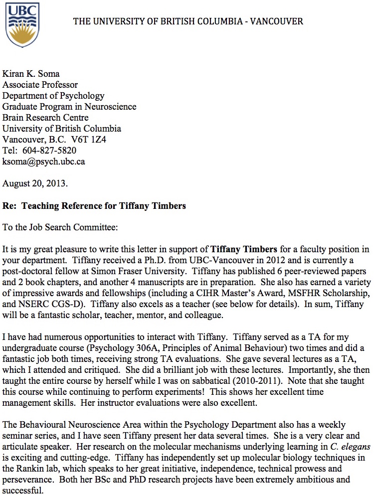
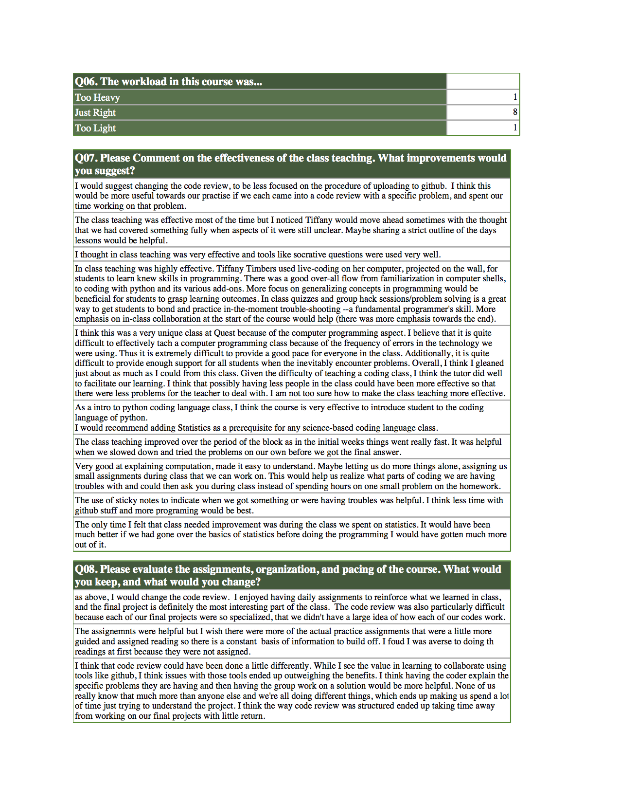
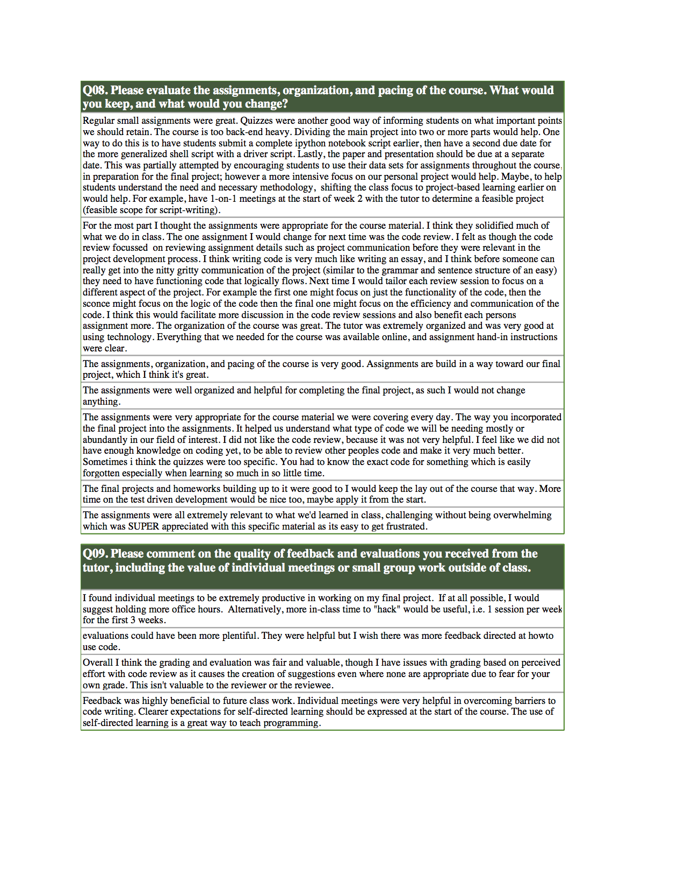
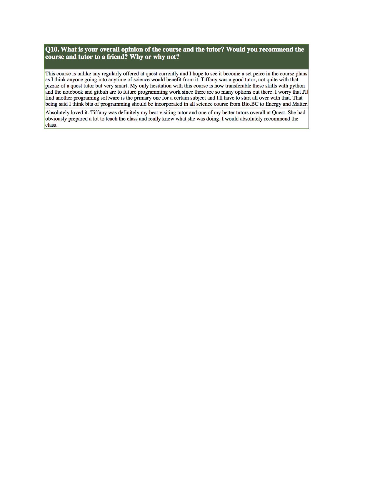

##Tiffany A. Timbers, Ph.D.
Simon Fraser University, 8888 University Drive,Burnaby, BC, Canada V5A 1S6  

tel. 604-803-4962  
email. [tiffany.timbers@gmail.com](mailto:tiffany.timbers@gmail.com) 
website: [tiffanytimbers.com](tiffanytimbers.com) 
Github: [github.com/ttimbers](github.com/ttimbers)

 

## Teaching Portfolio

1. Teaching Philosophy
2. Evidence of Teaching Effectiveness

### 1. Teaching Philosophy

I have thoroughly enjoyed my involvement in teaching throughout my undergraduate, graduate and postdoctoral studies and I am eager to expand my role in the educational process. I began working as a teaching assistant in the fourth year of my undergraduate degree, and continued to do so throughout my graduate studies at the University of British Columbia (UBC) as well as at Marine Biological Laboratory at Woods Hole, MA, USA. These experiences culminated in a unique opportunity to independently instruct a third year Animal Behavior class of 100 students at UBC while I was a Ph.D. Candidate. Recently I have expanded my teaching experience as a volunteer Software Carpentry instructor (teaching basic computer programming skills to scientists at hands-on workshops), teaching bioinformatics to graduate students at Titus Brown's Next Generation Sequencing summer course, and developing and teaching a Computation in Science course at Quest University.

As a result of my experiences, I have come to believe the most important skills that an educator should focus on cultivating in their students are: (1) critical thinking, (2) creativity, and (3) self-learning. Regardless of whether students pursue further academic training, attend a professional school or join industry, these skills are necessary for future success. In my teaching I have implemented several strategies for the development of these skills. 

First, I recognize that there are many different learning styles. Therefore, I present new concepts in more than one format so that I may reach everyone. For example, when teaching loops in computer programming I provide: *(i)* a visual example, *(ii)* a verbal and written explanation, and *(iii)* take a break from instruction and ask the students to use a loop for themselves to solve a given problem. This strategy also has the advantage that the information is reinforced by different types of input.

Second, I believe that motivation is important for successful learning, as it can energize, direct, and sustain learning. One way I use motivation to enhance learning is by providing extrinsic motivators, such as a clear marking rubric on assignments and exams. Another way I effectively use motivation is to harness the intrinsic motivation of each student through assignments where the student chooses the topic themselves as long as it falls under the umbrella of the course topic. For example, in the Computation in the Physical Sciences course that I taught the students were asked to choose a topic of interest for their final project. Although the final project was not due until the end of term, the students assignments each evening throughout the course were to apply the concepts learned in class that day to the dataset they were working on. This kept the students really engaged in the assignments, as they could easily see the practical value of each days learning as they applied it to their own data.

Third, to facilitate the development of critical thinking and creativity I like to use problem-based learning (PBL) approaches. For example, in the animal behavior course I taught, the students had difficulty critically evaluating experiments and devising new experiments to test a given hypothesis. To help them grasp this challenging but important skill, I utilized a PBL approach where I presented real experimental data that tested a hypothesis, and then had the students break into small groups to work together to answers to questions, such as “what are the weaknesses of this experimental approach?” and “what is another experiment that you could do to test the same hypothesis?”. I then asked several of the groups to present their answers and we discussed which answers were correct. 

My teaching reviews revealed that students found this approach helped them develop the critical thinking skills required to evaluate experimental design and the creativity to propose new ones. On the teaching evaluations, students graded whether intelligent, independent thought by students was encouraged as 4.6/5, and one student commented that, “I thoroughly enjoyed the class and learned a lot from it. The instructor encouraged participation and focused on thinking critically about the science of animal behavior, unlike most other classes I've taken at UBC.” Another said, “Prof. Timbers is simply fantastic. Her interest in the field really shined through in her lectures, and really stimulated our interest on the subject. She made every effort to answer all of our questions, and when questioned on things beyond her knowledge, she would go out of her way to search for answers so we can discuss them in the preceding lecture. Exams also require critical thinking instead of pure memorization, which made writing it both challenging and rewarding!” Finally, the interest in experimental approaches to understanding animal behavior inspired one of the students taking the course, Angela Leong, to volunteer in the lab where I was performing my Ph.D.

Lastly, I recognize that many undergraduate students struggle to develop effective learning practices and skills. Not all students are aware of different pedagogical learning styles, let alone which style best suits them, or what “out of classroom” study habits are most efficient or effective. I believe that it is our job as educators to help students learn how to self-learn. This could be implemented in lower level classes by: *(i)* providing awareness to each student of their learning style through quick and simple self-assessment quizzes, and *(ii)* informing students which study methods are most effective (i.e. testing yourself repeatedly instead of simply re-reading your notes and the text book), and *(iii)* as mentioned above, integrating group work in teaching to help students build a supportive peer learning network. Incorporating these strategies at lower levels will lay a foundation of self-learning skills that students can build upon throughout their lifetime.

#### Emerging technologies and innovative practices in teaching and learningß
To continually develop my teaching skills and best support my students learning, I strive to incorporate new teachnologies and practices in teaching and learning. Examples of emerging technologies that I have utilized are the free online quizzing system Socrative and Classroom for Github for student submission of homework, and student peer code-review. When I teach Python I have also utilized the Jupyter notebook.

Innovative teaching practices that I use in the classroom include live-coding  where students follow along on their own laptops. These sessions are interspersed with challenge problems. To ensure students are following along I implement a "sticky" system, where students have two colours of post it notes, with one colour (*e.g.,* yellow) meaning everything is good and I am following and another colour (*e.g.,* blue) meaning that you are going to fast, or this is confusing. This allows me to quickly and easily check-in with students and adjust my teaching if necessary. 

I also encourage students to work together to foster peer-learning as much as possible. Ways that I faciliatate this are through group assignments, and small group code review. It is amazing how much students learn about reusability, readability and documentation when they have to read and run another person's code.

### 2. Evidence of Teaching Effectiveness

a. Letter of teaching effectiveness from Dr. Kiran Soma, Professor, Department of Psychology, University of British Columbia. 
b. Instructor Evaluations from [PHY3009 Computation in the Physcial Sciences](http://phy3009.github.io/PHY3009-2015/) at Quest University 

#### a. Letter of teaching effectiveness

#### b. Instructor Evaluations

